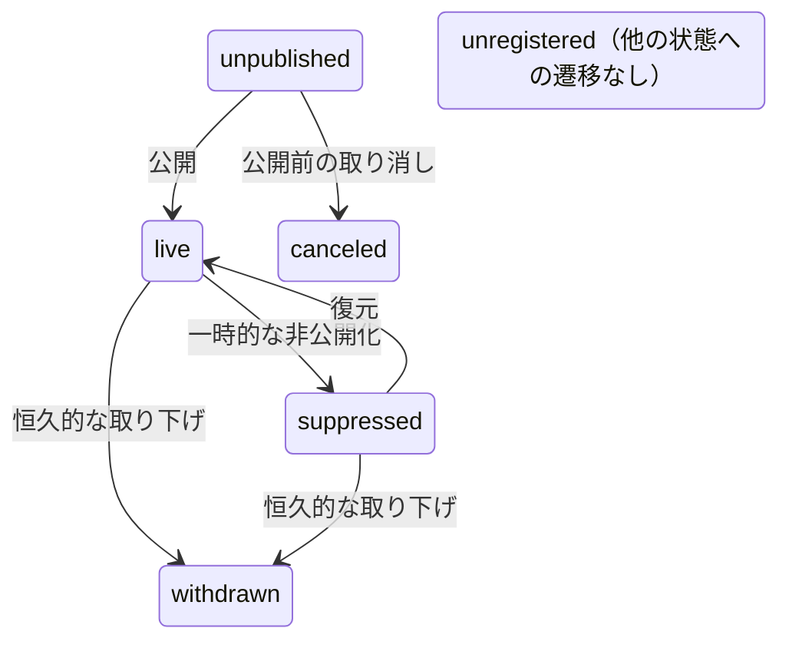

# Record Status 設計

record-idm が管理する `record_status` の設計と、各リポジトリの生 status からのマッピングを定義する。

## 概要

`record_status` は accession のデータ公開状態を表す。外の世界から見た「そのデータに到達できるか」を示す次元であり、INSDC 標準の 4 値を基本に DDBJ 内部管理用の値を拡張する。

投稿処理の段階（submitted, in_curation 等）は別次元 `submission_stage` で管理する。詳細は [Submission Stage 設計](./submission-stage.md) を参照。

参考: ddbj-search-converter の `schema.py` では `Status = Literal["live", "unpublished", "suppressed", "withdrawn"]`（INSDC 標準 4 値）として定義されている。record-idm はこれを拡張し、DDBJ 内部管理用の値を追加する。

## record_status の定義値

### INSDC 標準値

| 値 | 意味 | INSDC |
|------|------|------|
| `unpublished` | 登録済みだが未公開。hold 期間中、キュレーション中等 | `unpublished` |
| `live` | 公開中。誰でもアクセス可能 | `live` |
| `suppressed` | 公開後に非公開化。データ品質問題、登録者の要望等。復元の可能性あり | `suppressed` |
| `withdrawn` | 公開後に恒久的に削除。復元しない前提 | `withdrawn` |

### DDBJ 拡張値

| 値 | 意味 | INSDC 対応 |
|------|------|------|
| `canceled` | 公開前に取り消し。一度も公開されておらず、今後も公開されない | なし |
| `unregistered` | accession 番号は確保されたが、データ登録がされていない | なし |

### `withdrawn` と `canceled` の区別

両方とも「もうデータにアクセスできない」終端状態だが、公開実績の有無が異なる。

| | `withdrawn` | `canceled` |
|---|---|---|
| 公開実績 | あり（一度は `live` を経由） | なし（`live` を経由していない） |
| 既存の名前 | Trad `killed`、INSDC `withdrawn` | BioProject/BioSample `canceled`、2020 仕様 `cancel` |
| 件数規模 | Trad 178 万、SRA 2,687 | BioSample 84,554、BioProject 1,546 |

### `replaced` / `secondary` は record_status ではなく relation

Trad の `secondary`（26,723 件）や SRA の `replaced` は「別の accession に統合された」ことを表す。これは公開状態ではなく accession 間の関係性であるため、record_status には含めず relation レイヤーで `replaced_by` として管理する。

- Trad `secondary` の record_status は `suppressed` にマッピングする（INSDC では secondary accession は suppressed 扱いが一般的）
- SRA `replaced` の record_status は `withdrawn` にマッピングする（ddbj-search-converter の既存挙動に合わせる）
- いずれも relation として `replaced_by` → 統合先 accession を保持する

## 状態遷移

| 遷移 | 意味 |
|------|------|
| `unpublished` → `live` | 公開（hold 期間終了、キュレーション完了） |
| `live` → `suppressed` | 一時的な非公開化（データ品質問題等） |
| `suppressed` → `live` | 復元（データ修正後の再公開） |
| `live` → `withdrawn` | 恒久的な取り下げ |
| `suppressed` → `withdrawn` | suppressed から更に withdrawn へ |
| `unpublished` → `canceled` | 公開前の取り消し |

逆方向の遷移（`withdrawn` → `live` 等）は原則として発生しない。`unregistered` は他の状態への遷移を持たない（番号が使用されれば `unpublished` になるが、それは新規登録と同等）。

## visibility / searchability の導出

2020 年の「DDBJ-LD：レコードステイタス仕様書」では `visibility` と `searchability` を独立プロパティとして定義していたが、record_status から一意に導出できるため、プロパティとしては持たない。

| record_status | visibility | searchability | 備考 |
|---|---|---|---|
| `unpublished` | false | false | 登録者のみアクセス可能 |
| `live` | true | true | 誰でもアクセス・検索可能 |
| `suppressed` | by accession | false | accession 直指定でのみ閲覧可。検索結果には出ない |
| `withdrawn` | false | false | アクセス不可 |
| `canceled` | false | false | アクセス不可 |
| `unregistered` | false | false | 実体なし |

## INSDC status への変換

INSDC 互換の出力（livelist 等）が必要な場合、以下で変換する。

| record_status | → INSDC status | 備考 |
|---|---|---|
| `unpublished` | `unpublished` | |
| `live` | `live` | |
| `suppressed` | `suppressed` | |
| `withdrawn` | `withdrawn` | |
| `canceled` | （出力対象外） | INSDC に対応する値がない |
| `unregistered` | （出力対象外） | INSDC に対応する値がない |

## 各リポジトリの生 status → record_status マッピング

### Trad

`manager` テーブルの `status` カラム（smallint）。

| st_id | st_name | 件数 | → record_status | 備考 |
|---|---|---|---|---|
| 1001 | private | 2,727,344 | `unpublished` | hold 期間中 |
| 1002 | public | 176,615,646 | `live` | |
| 1004 | suppressed | 5,460,824 | `suppressed` | |
| 1005 | secondary | 26,723 | `suppressed` | relation `replaced_by` も設定する |
| 1006 | killed | 1,785,318 | `withdrawn` | |
| 1007 | unregistered | 337,992 | `unregistered` | |

### BioProject / BioSample

`mass.project` / `mass.sample` テーブルの `status_id` カラム。

| status_id | 意味 | → record_status | 備考 |
|---|---|---|---|
| 5100 | submitted | `unpublished` | submission_stage = `submitted` |
| 5200 | curating | `unpublished` | submission_stage = `in_curation` |
| 5400 | private | `unpublished` | submission_stage = `accepted` |
| 5500 | public | `live` | |
| 5600 | killed | `withdrawn` | |
| 5700 | canceled | `canceled` | |
| 5800 | suppressed | `suppressed` | |
| 5900 | TODO（不明） | ? | 要調査 |

### SRA（全極、NCBI 作成）

SRA_Accessions.tab の `Status` カラム。

| status | 件数 | → record_status | 備考 |
|---|---|---|---|
| live | 127,775,189 | `live` | |
| unpublished | 11,166,969 | `unpublished` | |
| suppressed | 5,147,698 | `suppressed` | |
| withdrawn | 2,687 | `withdrawn` | |
| replaced | (注) | `withdrawn` | relation `replaced_by` も設定する |

注: ddbj-search-converter では `replaced` → `withdrawn`、`killed` → `withdrawn`、NULL → `live` として処理している。

### DRA（自極、DDBJ 作成）

DRA_Accessions.tab は公開済みのみ出力される。未公開分は D-way (tracesys) 内で管理。

| status | 件数 | → record_status |
|---|---|---|
| public | 2,287,939 | `live` |
| suppressed | 16,984 | `suppressed` |
| withdrawn | 327 | `withdrawn` |

### GEA

livelist ファイルの `Status` カラム。公開済みのみ。

| status | 件数 | → record_status |
|---|---|---|
| Public | 676 | `live` |
| Permanently Suppressed | 4 | `suppressed` |
| Withdrawn | 2 | `withdrawn` |

### JGA

申請管理システムの `appl_status_type` から変換する。accession 未発行のレコードも管理対象とする。

| コード | 意味 | → record_status | 備考 |
|---|---|---|---|
| 10 | 申請書類作成中 | `unpublished` | accession 未発行 |
| 20 | 申請完了 | `unpublished` | accession 未発行 |
| 30 | 差し戻し中 | `unpublished` | accession 未発行 |
| 40 | 審査中 | `unpublished` | accession 未発行 |
| 50 | 却下 | `canceled` | accession 未発行 |
| 60 | 承認 | `live` | accession 発行済み |
| 70 | 取り下げ | `canceled` | accession 未発行 or 発行済み。要調査 |
| 80 | 利用期間終了 | TODO | 要調査 |

### AGD

JGA と同じ構成。

### MetaboBank

study ディレクトリ内の status file の有無で判定。

| 判定条件 | → record_status |
|---|---|
| Public Release Date あり | `live` |
| Public Release Date なし | `unpublished` |
| status-temporarily-suppressed.txt | `suppressed` |
| status-permanently-suppressed.txt | `suppressed` |
| status-cancelled.txt | `canceled` |
| status-killed.txt | `withdrawn` |
| status-reviewer-access.txt | `unpublished` |

### JVar

Excel メタデータの `Hold/Release` フィールド。

| Hold/Release | → record_status |
|---|---|
| Release | `live` |
| Hold | `unpublished` |

## マッピング一覧（サマリ）

| リポジトリ | 生 status | → record_status |
|---|---|---|
| Trad | public | `live` |
| Trad | private | `unpublished` |
| Trad | suppressed | `suppressed` |
| Trad | secondary | `suppressed` + relation `replaced_by` |
| Trad | killed | `withdrawn` |
| Trad | unregistered | `unregistered` |
| BioProject/BioSample | public (5500) | `live` |
| BioProject/BioSample | submitted (5100) | `unpublished` |
| BioProject/BioSample | curating (5200) | `unpublished` |
| BioProject/BioSample | private (5400) | `unpublished` |
| BioProject/BioSample | suppressed (5800) | `suppressed` |
| BioProject/BioSample | killed (5600) | `withdrawn` |
| BioProject/BioSample | canceled (5700) | `canceled` |
| BioProject/BioSample | 5900 | ? |
| SRA | live | `live` |
| SRA | unpublished | `unpublished` |
| SRA | suppressed | `suppressed` |
| SRA | withdrawn | `withdrawn` |
| SRA | replaced | `withdrawn` + relation `replaced_by` |
| DRA | public | `live` |
| DRA | suppressed | `suppressed` |
| DRA | withdrawn | `withdrawn` |
| GEA | Public | `live` |
| GEA | Permanently Suppressed | `suppressed` |
| GEA | Withdrawn | `withdrawn` |
| JGA | 承認 (60) | `live` |
| JGA | 申請中 (10-40) | `unpublished` |
| JGA | 却下 (50) / 取り下げ (70) | `canceled` |
| MetaboBank | Public | `live` |
| MetaboBank | Private | `unpublished` |
| MetaboBank | Temporarily/Permanently suppressed | `suppressed` |
| MetaboBank | Cancelled | `canceled` |
| MetaboBank | Killed | `withdrawn` |
| MetaboBank | In review | `unpublished` |
| JVar | Release | `live` |
| JVar | Hold | `unpublished` |

## 検討事項

### 1. temporarily vs permanently suppressed

MetaboBank と GEA で区別がある。INSDC 標準では区別しない（`suppressed` のみ）。record_status としては `suppressed` に統一し、区別が必要な場合は補助属性（`suppression_type` 等）で対応する案がある。

### 2. JGA/AGD の status 管理

controlled-access データ固有の検討事項:

- accession が XML に出力された時点で `live` として良いか
- `appl_status_type = 70`（取り下げ）で accession 発行済みのケースの扱い
- `appl_status_type = 80`（利用期間終了）の record_status

### 3. 未公開分の status ソース

公開済みのみが外部ファイルに含まれるリポジトリがある。`unpublished` の accession を管理するには各リポジトリの内部 DB にアクセスする必要がある。

| リポジトリ | 公開済みソース | 未公開ソース |
|---|---|---|
| BioProject | livelist | 自極 DB（mass.project） |
| BioSample | livelist | 自極 DB（mass.sample） |
| DRA | DRA_Accessions.tab | D-way (tracesys) |
| GEA | livelist.txt | 不明 |
| MetaboBank | livelist | status file + IDF |
| JVar | 公開ディレクトリ | submission ディレクトリ |

### 4. BioProject/BioSample `5900` の意味

BioProject 97 件、BioSample 4,103 件。意味が不明。要調査。
