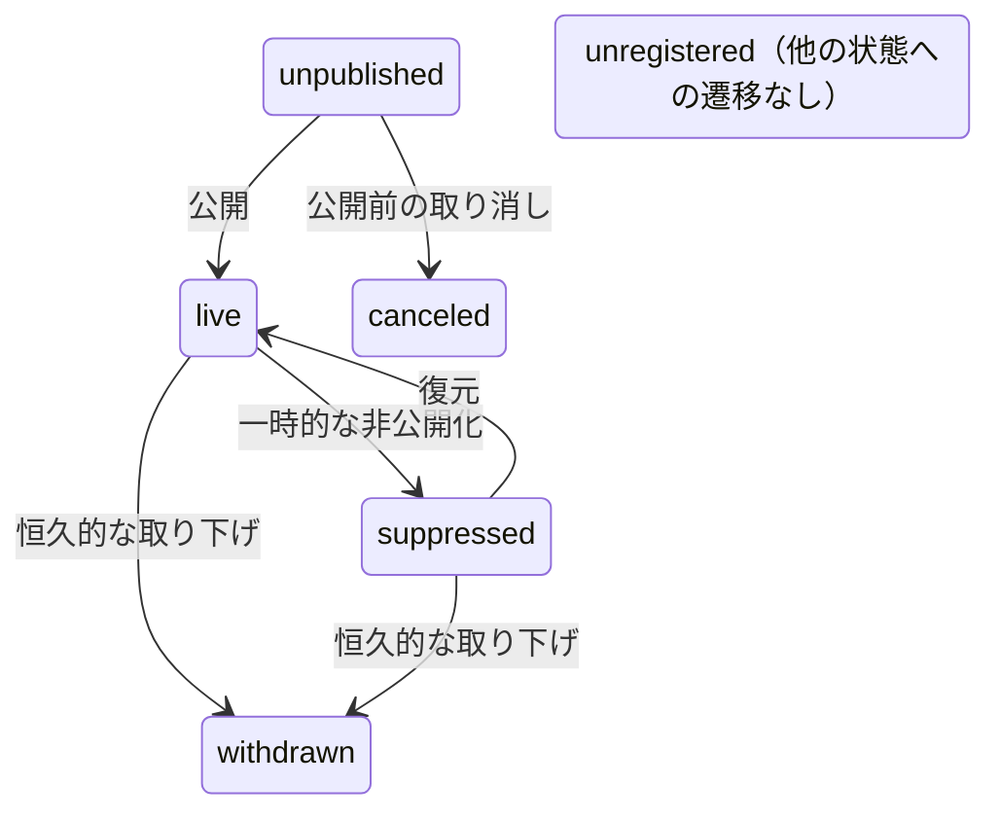

# Record Status 定義

record-idm が管理する `record_status` の定義。2 次元モデルの全体像は [data-model.md](./data-model.md) を参照。

`record_status` は accession のデータ公開状態を表す。外の世界から見た「そのデータに到達できるか」を示す次元であり、INSDC 標準の 4 値を基本に DDBJ 内部管理用の値を拡張する。

## record_status の定義値

### INSDC 標準値

| 値            | 意味                                                               | INSDC         |
| ------------- | ------------------------------------------------------------------ | ------------- |
| `unpublished` | 登録済みだが未公開。hold 期間中、キュレーション中等                | `unpublished` |
| `live`        | 公開中。メタデータとして到達可能                                   | `live`        |
| `suppressed`  | 公開後に非公開化。データ品質問題、登録者の要望等。復元の可能性あり | `suppressed`  |
| `withdrawn`   | 公開後に恒久的に削除。復元しない前提                               | `withdrawn`   |

- `live` は controlled-access データ（JGA/AGD 等）にも適用する。データ本体へのアクセスには利用申請が必要でも、メタデータが公開されておりデータの存在が公に到達可能であれば `live`。アクセス制御の種類（public/controlled）は record_status とは別の次元で管理する
- `suppressed` は temporarily / permanently の区別をしない（MetaboBank・GEA では区別があるが、「外から見た到達可能性」の観点では振る舞いが同じであるため統一する）

### DDBJ 拡張値

| 値             | 意味                                                         | INSDC 対応 |
| -------------- | ------------------------------------------------------------ | ---------- |
| `canceled`     | 公開前に取り消し。一度も公開されておらず、今後も公開されない | なし       |
| `unregistered` | accession 番号は確保されたが、データ登録がされていない       | なし       |

### `withdrawn` と `canceled` の区別

両方とも「もうデータにアクセスできない」終端状態だが、公開実績の有無が異なる。

|            | `withdrawn`                      | `canceled`                                          |
| ---------- | -------------------------------- | --------------------------------------------------- |
| 公開実績   | あり（一度は `live` を経由）     | なし（`live` を経由していない）                     |
| 既存の名前 | Trad `killed`、INSDC `withdrawn` | BioProject/BioSample `canceled`、2020 仕様 `cancel` |
| 件数規模   | Trad 178 万、SRA 2,687           | BioSample 84,554、BioProject 1,546                  |

### `replaced` / `secondary` は record_status ではなく relation

Trad の `secondary`（26,723 件）や SRA の `replaced` は「別の accession に統合された」ことを表す。これは公開状態ではなく accession 間の関係性であるため、record_status には含めず relation レイヤーで `replaced_by` として管理する。

- Trad `secondary` の record_status は `suppressed` にマッピングする（INSDC では secondary accession は suppressed 扱いが一般的）
- SRA `replaced` の record_status は `suppressed` にマッピングする（データは統合先に存在しており、accession 直指定でリダイレクト可能であるため `withdrawn`（恒久的削除）ではなく `suppressed` が適切）
- いずれも relation として `replaced_by` → 統合先 accession を保持する

## 状態遷移

| 遷移                       | 意味                                      |
| -------------------------- | ----------------------------------------- |
| `unpublished` → `live`     | 公開（hold 期間終了、キュレーション完了） |
| `live` → `suppressed`      | 一時的な非公開化（データ品質問題等）      |
| `suppressed` → `live`      | 復元（データ修正後の再公開）              |
| `live` → `withdrawn`       | 恒久的な取り下げ                          |
| `suppressed` → `withdrawn` | suppressed から更に withdrawn へ          |
| `unpublished` → `canceled` | 公開前の取り消し                          |

逆方向の遷移（`withdrawn` → `live` 等）は原則として発生しない。`unregistered` は他の状態への遷移を持たない（番号が使用されれば `unpublished` になるが、それは新規登録と同等）。

## visibility / searchability の導出

2020 年の [DDBJ-LD：レコードステイタス仕様書](https://ddbj-dev.atlassian.net/wiki/spaces/D/pages/328433665/DDBJ-LD) では `visibility` と `searchability` を独立プロパティとして定義していたが、record_status から一意に導出できるため、プロパティとしては持たない。

| record_status  | visibility   | searchability | 備考                                             |
| -------------- | ------------ | ------------- | ------------------------------------------------ |
| `unpublished`  | false        | false         | 登録者のみアクセス可能                           |
| `live`         | true         | true          | 誰でもアクセス・検索可能                         |
| `suppressed`   | by accession | false         | accession 直指定でのみ閲覧可。検索結果には出ない |
| `withdrawn`    | false        | false         | アクセス不可                                     |
| `canceled`     | false        | false         | アクセス不可                                     |
| `unregistered` | false        | false         | 実体なし                                         |

## INSDC status への変換

INSDC 互換の出力（livelist 等）が必要な場合、以下で変換する。

| record_status  | → INSDC status   | 備考                     |
| -------------- | ---------------- | ------------------------ |
| `unpublished`  | `unpublished`    |                          |
| `live`         | `live`           |                          |
| `suppressed`   | `suppressed`     |                          |
| `withdrawn`    | `withdrawn`      |                          |
| `canceled`     | （出力から除外） | INSDC に対応する値がない |
| `unregistered` | （出力から除外） | INSDC に対応する値がない |

「出力から除外」の意味: `canceled` と `unregistered` のレコードは INSDC フォーマットの出力（livelist 等）に含めない。いずれも一度も `live` になったことがない accession であり、INSDC 側にその存在が知られていないため、出力から省略しても整合性の問題は生じない。record-idm 内部では引き続き管理対象として保持する。
