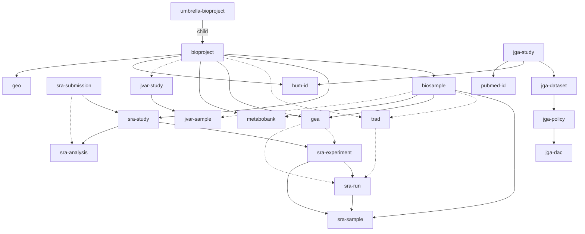
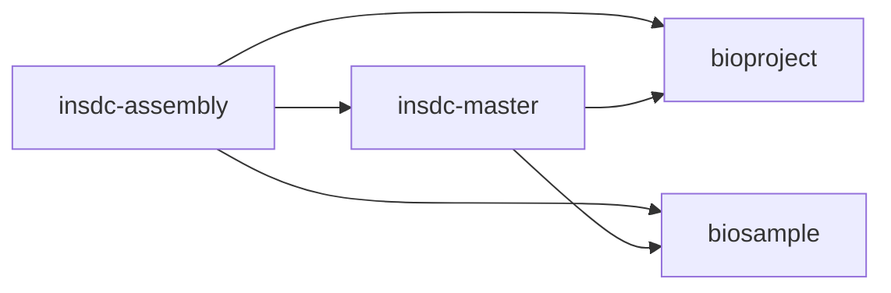
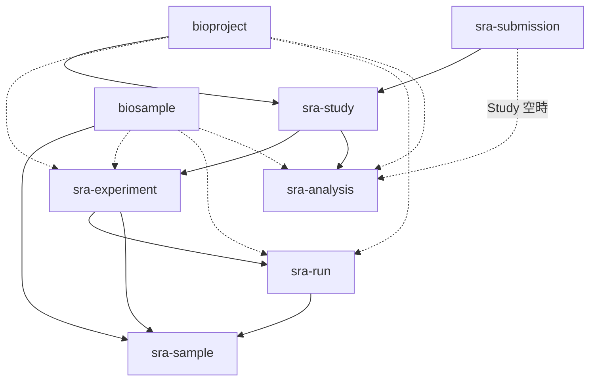
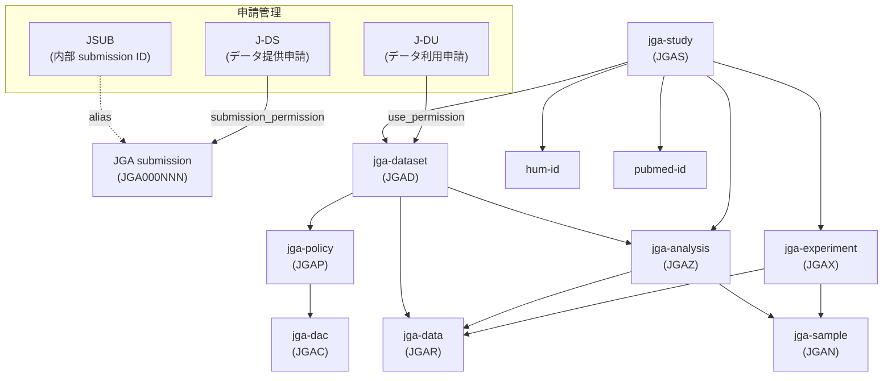
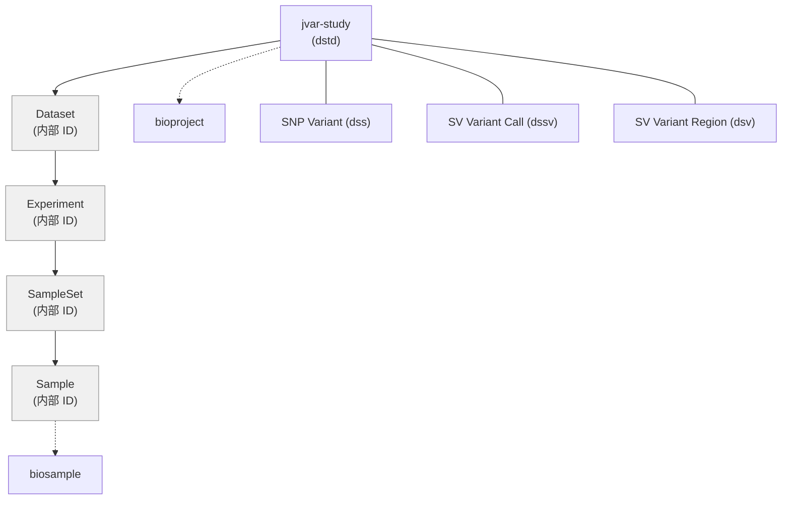

# Accession 間 Relation

DDBJ の各リポジトリが管理する accession 間の relation を定義する。
データソースの詳細は [repositories.md](./repositories.md) を参照。

## 凡例

- 図の矢印方向: 概念的な親 → 子（BioProject を頂点とする DAG の上から下）
- 実線（`-->`）: 直接的な参照関係
- 破線（`-.->`）: 間接的・オプショナル・dblink 外の関係
- Edge 一覧テーブルはデータソース上の参照方向で記載（`A -> B` = 「A のデータに B への参照がある」）
- ddbj-search-converter の dblink は無向グラフ（`normalize_edge()` で正規化）

## リポジトリ間 Relation

BioProject を頂点として、各リポジトリの accession がどのように紐づくかの概要。

### 補足

- **JGA/AGD と BioProject**: 直接の edge はない。BioProject と JGA Study がそれぞれ hum-id を参照しており、hum-id を介して間接的に対応する。直接 edge の追加は TODO（[submission.md](./submission.md) 参照）
- **Trad**: dblink には trad edge は含まれない（Trad DB `link_pr_ac` + `project` で直接管理）。図では破線で表示
- **JVar**: dblink に含まれない（ファイルベース管理）。図では破線で表示
- **SRA の denormalized edge**: dblink には `bioproject -> sra-experiment / sra-run / sra-analysis`、`biosample -> sra-experiment / sra-run / sra-analysis` も格納される（Accessions.tab の非正規化カラム由来）。全体図では省略、SRA 内部図に記載
- **Assembly**: 下記の別図を参照

### Assembly

insdc-assembly / insdc-master は BioProject / BioSample を参照する（全体図の DAG 方向と逆になるため別図）。

データソース: `assembly_summary_genbank.txt`（NCBI FTP）+ Trad organism list。

## SRA 内部 Relation

SRA の 6 accession type 間の階層と、BioProject / BioSample との接続。
実線は正規化された親子 edge、破線は Accessions.tab の非正規化カラム由来（denormalized）。

prefix の 1 文字目が極を表す: D=DDBJ, S=NCBI, E=EBI（例: DRR, SRR, ERR）。

## JGA/AGD 内部 Relation

JGA accession type 間の階層と、申請管理システムの ID との接続。AGD も同一構成。

Study（研究単位）と Dataset（データアクセス単位）の 2 つの頂点を持つ DAG。

### dblink に格納される edge

ddbj-search-converter の dblink には JGA の高レベル relation のみ格納される。experiment / sample / data / analysis 間の関係は CSV に存在するが dblink には含まれない。

| from | to | 構築方法 |
|---|---|---|
| jga-dataset | jga-policy | CSV 直接 |
| jga-policy | jga-dac | CSV 直接 |
| jga-study | jga-dataset | CSV hop（2 経路の union） |
| jga-study | jga-policy | CSV hop |
| jga-study | jga-dac | CSV hop |
| jga-dataset | jga-dac | CSV hop |
| jga-study | hum-id | XML 直接 |
| jga-study | pubmed-id | XML 直接 |

## JVar 内部 Relation

内部階層は accession なし（内部 ID のみ）。accession を持つのは study と variant のみ。

JVar は現在 dblink に含まれていない。

## Edge 一覧

データソース上の参照方向（`A -> B` = 「A のデータに B への参照がある」）で記載。

### リポジトリ間

| from | to | データソース | dblink |
|---|---|---|---|
| bioproject | umbrella-bioproject | BioProject XML / DB `umbrella_info` | ✓ |
| bioproject | hum-id | BioProject XML `LocalID` | ✓ |
| bioproject | geo | BioProject XML `CenterID` | ✓ |
| biosample | bioproject | BioSample DB/XML + SRA Accessions.tab | ✓ |
| insdc-assembly | bioproject | assembly_summary_genbank.txt | ✓ |
| insdc-assembly | biosample | assembly_summary_genbank.txt | ✓ |
| insdc-assembly | insdc-master | assembly_summary_genbank.txt | ✓ |
| insdc-master | bioproject | assembly_summary + Trad organism list | ✓ |
| insdc-master | biosample | assembly_summary + Trad organism list | ✓ |
| gea | bioproject | GEA IDF `Comment[BioProject]` | ✓ |
| gea | biosample | GEA SDRF `Comment[BioSample]` | ✓ |
| metabobank | bioproject | MetaboBank IDF `Comment[BioProject]` | ✓ |
| metabobank | biosample | MetaboBank SDRF `Comment[BioSample]` | ✓ |
| jga-study | hum-id | JGA XML `STUDY_ATTRIBUTES` | ✓ |
| jga-study | pubmed-id | JGA XML `PUBLICATIONS` | ✓ |
| trad | bioproject | Trad DB `link_pr_ac` + `project` | - |
| trad | biosample | Trad DB `link_pr_ac` + `project` | - |
| trad | sra-run | Trad DB `link_pr_ac` + `project` | - |
| gea | sra-experiment | GEA SDRF `Comment[SRA_EXPERIMENT]` | - |
| gea | sra-run | GEA SDRF `Comment[SRA_RUN]` | - |
| jvar-study | bioproject | JVar Excel `BioProject Accession` | - |
| jvar-sample | biosample | JVar Excel `BioSample Accession` | - |

### SRA 内部

全て Accessions.tab 由来、全て dblink に格納。

| from | to | 備考 |
|---|---|---|
| sra-submission | sra-study | |
| sra-study | sra-experiment | |
| sra-study | sra-analysis | |
| sra-submission | sra-analysis | Study 空の場合の fallback |
| sra-experiment | sra-run | |
| sra-experiment | sra-sample | |
| sra-run | sra-sample | |
| bioproject | sra-study | |
| bioproject | sra-experiment | denormalized |
| bioproject | sra-run | denormalized |
| bioproject | sra-analysis | denormalized |
| biosample | sra-sample | |
| biosample | sra-experiment | denormalized |
| biosample | sra-run | denormalized |
| biosample | sra-analysis | denormalized |

### JGA 内部

CSV の参照方向（parent → child）で記載。

| parent | child | CSV | dblink |
|---|---|---|---|
| study | experiment | experiment-study-relation.csv | - |
| study | analysis | analysis-study-relation.csv | - |
| experiment | data | data-experiment-relation.csv | - |
| experiment | sample | experiment-sample-relation.csv | - |
| dataset | data | dataset-data-relation.csv | - |
| dataset | analysis | dataset-analysis-relation.csv | - |
| dataset | policy | dataset-policy-relation.csv | ✓ |
| policy | dac | policy-dac-relation.csv | ✓ |
| analysis | sample | analysis-sample-relation.csv | - |
| analysis | data | analysis-data-relation.csv | - |

dblink に格納される hop edge:

| from | to | hop 経路 |
|---|---|---|
| jga-study | jga-dataset | study ← experiment ← data → dataset **∪** study ← analysis → dataset |
| jga-study | jga-policy | study → dataset → policy |
| jga-study | jga-dac | study → dataset → policy → dac |
| jga-dataset | jga-dac | dataset → policy → dac |

### JGA/AGD 申請管理

| from | to | mechanism |
|---|---|---|
| J-DS | JGA submission | `submission_permission` テーブル |
| J-DU | jga-dataset (JGAD) | `use_permission` テーブル |
| JSUB | JGA submission | `accession.alias` マッピング |
| JGA submission | hum-id | `metadata` XML の `nbdc_number` 属性 |
