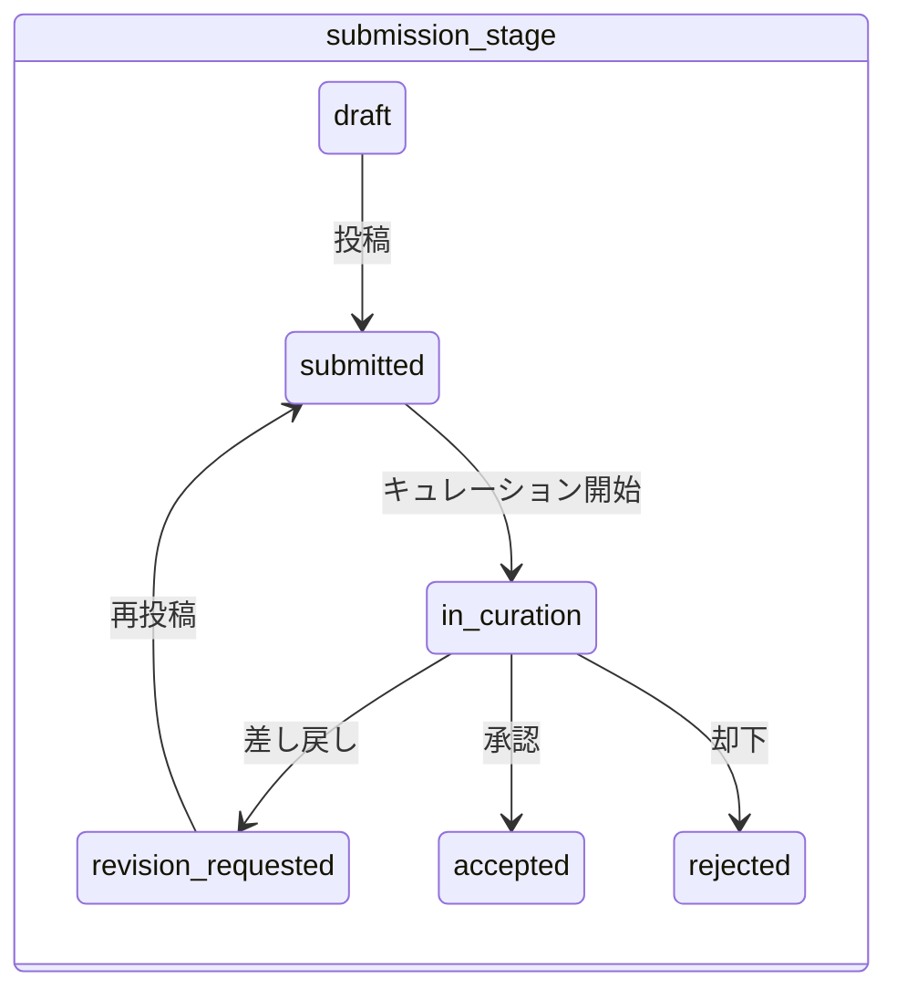

# Submission Stage 設計

record-idm が管理する `submission_stage` の設計と、各リポジトリからのマッピングを定義する。

## record_status との関係

record-idm は accession の状態を 2 つの直交する次元で管理する。

| 次元 | 意味 | 例 |
|------|------|------|
| `record_status` | データの公開状態（外の世界から見た到達可能性） | live, suppressed, withdrawn |
| `submission_stage` | 投稿処理の段階（DDBJ 内部のワークフロー状態） | submitted, in_curation, accepted |

`record_status` は [Record Status 設計](./record-status.md) で定義する。本ドキュメントでは `submission_stage` を定義する。

### なぜ 2 次元か

既存の各リポジトリの status 値には、公開状態と投稿処理段階が混在している。例えば BioProject/BioSample の `submitted(5100)`, `curating(5200)`, `private(5400)` は全て record_status としては `unpublished` だが、投稿処理の段階が異なる。これらを 1 つの enum に押し込むと情報が失われる。

2 次元に分離することで:

- `record_status` は INSDC 標準と互換性を維持できる
- `submission_stage` で投稿処理の詳細な段階を追跡できる
- 各リポジトリが持つ粒度の違いを吸収できる（submission_stage は nullable）

### 設計判断の経緯

- 2020 年の「DDBJ-LD：レコードステイタス仕様書」では、全ライフサイクルを 1 つの enum（unsubmitted, submitted, private, public, suppressed, replaced, killed, cancel）に入れ、`visibility` / `searchability` の boolean フラグで意味を補足する設計だった
- `visibility` / `searchability` は record_status から導出可能なため、独立したプロパティとしては持たない
- Schema.org は `creativeWorkStatus`（コンテンツのライフサイクル）と `actionStatus`（プロセスの実行状態）で暗黙的に 2 次元を分離している
- INSDC は accession status（公開状態）のみ標準化し、submission workflow は各アーカイブの内部実装に委ねている。record-idm はこの暗黙的な分離を明示化した形になる

## submission_stage の定義値

| 値 | 意味 |
|------|------|
| `draft` | 作成中、未投稿 |
| `submitted` | 投稿済み、処理待ち |
| `in_curation` | キュレーション/審査中 |
| `revision_requested` | 差し戻し（修正依頼中） |
| `accepted` | 承認済み/処理完了 |
| `rejected` | 却下 |

submission_stage は **nullable** とする。全てのリポジトリが投稿処理段階を公開しているわけではないため、情報が取得できない場合は null とする。

## record_status × submission_stage の制約

2 つの次元は完全に独立ではなく、以下の制約がある。

| record_status | 許容される submission_stage |
|---|---|
| `unpublished` | `draft`, `submitted`, `in_curation`, `revision_requested`, `accepted` |
| `live` | `accepted` |
| `suppressed` | `accepted` |
| `withdrawn` | `accepted` |
| `canceled` | `draft`, `submitted`, `in_curation`, `rejected` |
| `unregistered` | null |

- `submission_stage` は主に `unpublished` の内訳を詳細化する役割を持つ
- 公開後（`live`, `suppressed`, `withdrawn`）は基本的に `accepted` 固定
- `canceled` は公開前に中止されたレコードであり、submission_stage は中止時点の段階を保持する

## 各リポジトリのマッピング

### BioProject / BioSample

`mass.project` / `mass.sample` テーブルの `status_id` から両次元をマッピングする。

| status_id | 意味 | → record_status | → submission_stage |
|---|---|---|---|
| 5100 | submitted | `unpublished` | `submitted` |
| 5200 | curating | `unpublished` | `in_curation` |
| 5400 | private | `unpublished` | `accepted` |
| 5500 | public | `live` | `accepted` |
| 5600 | killed | `withdrawn` | `accepted` |
| 5700 | canceled | `canceled` | null (注1) |
| 5800 | suppressed | `suppressed` | `accepted` |
| 5900 | TODO（不明） | ? | ? |

注1: canceled は公開前に取り消されたレコード。取り消し時点の submission_stage を復元できるかは要調査。

### Trad

`manager` テーブルの `status` から record_status をマッピングする。submission_stage は現状取得不可。

| st_id | st_name | → record_status | → submission_stage |
|---|---|---|---|
| 1001 | private | `unpublished` | null |
| 1002 | public | `live` | null |
| 1004 | suppressed | `suppressed` | null |
| 1005 | secondary | (注2) | null |
| 1006 | killed | `withdrawn` | null |
| 1007 | unregistered | `unregistered` | null |

注2: secondary は status ではなく relation（replaced_by）として扱う。record_status は `suppressed` にマッピングする。詳細は [record-status.md](./record-status.md) を参照。

### SRA (NCBI 作成)

Accessions.tab の `Status` カラムからマッピングする。

| status | → record_status | → submission_stage |
|---|---|---|
| live | `live` | null |
| unpublished | `unpublished` | null |
| suppressed | `suppressed` | null |
| withdrawn | `withdrawn` | null |
| replaced | (注3) | null |

注3: replaced は relation（replaced_by）として扱う。record_status は `withdrawn` にマッピングする。

### DRA (DDBJ 作成)

DRA_Accessions.tab は公開済みのみ出力される。未公開分は D-way (tracesys) 内で管理。

| status | → record_status | → submission_stage |
|---|---|---|
| public | `live` | null |
| suppressed | `suppressed` | null |
| withdrawn | `withdrawn` | null |

### GEA

livelist は公開済みのみ。未公開分の status ソースは不明。

| status | → record_status | → submission_stage |
|---|---|---|
| Public | `live` | null |
| Permanently Suppressed | `suppressed` | null |
| Withdrawn | `withdrawn` | null |

### JGA

申請管理システムの `appl_status_type` から両次元をマッピングする。accession 未発行のものも管理対象とする（J-DU, J-SU 等から参照されるため）。

| コード | 意味 | accession | → record_status | → submission_stage |
|---|---|---|---|---|
| 10 | 申請書類作成中 | 未発行 | `unpublished` | `draft` |
| 20 | 申請完了 | 未発行 | `unpublished` | `submitted` |
| 30 | 差し戻し中 | 未発行 | `unpublished` | `revision_requested` |
| 40 | 審査中 | 未発行 | `unpublished` | `in_curation` |
| 50 | 却下 | 未発行 | `canceled` | `rejected` |
| 60 | 承認 | 発行済み | `live` | `accepted` |
| 70 | 取り下げ | 未発行 or 発行済み | `canceled` | null |
| 80 | 利用期間終了 | 発行済み | TODO | TODO |

### AGD

JGA と同じ構成。

### MetaboBank

study ディレクトリ内の status file の有無で判定する。

| 判定条件 | → record_status | → submission_stage |
|---|---|---|
| Public Release Date あり | `live` | `accepted` |
| Public Release Date なし | `unpublished` | `accepted` |
| status-reviewer-access.txt | `unpublished` | `in_curation` |
| status-cancelled.txt | `canceled` | null |
| status-killed.txt | `withdrawn` | `accepted` |
| status-temporarily-suppressed.txt | `suppressed` | `accepted` |
| status-permanently-suppressed.txt | `suppressed` | `accepted` |

### JVar

| Hold/Release | → record_status | → submission_stage |
|---|---|---|
| Release | `live` | null |
| Hold | `unpublished` | null |

## TODO

- [ ] D-way (tracesys) の DB スキーマを調査し、Trad / SRA / DRA / GEA の submission_stage が取得可能か確認する
- [ ] BioProject/BioSample `5900` の意味を調査する
- [ ] BioProject/BioSample の `mass.submission` テーブルの `status_id`（100〜750）と `submission_stage` の関係を調査する
- [ ] JGA `appl_status_type = 70`（取り下げ）で accession 発行済みのケースがあるか調査する
- [ ] JGA `appl_status_type = 80`（利用期間終了）の record_status / submission_stage を決定する
