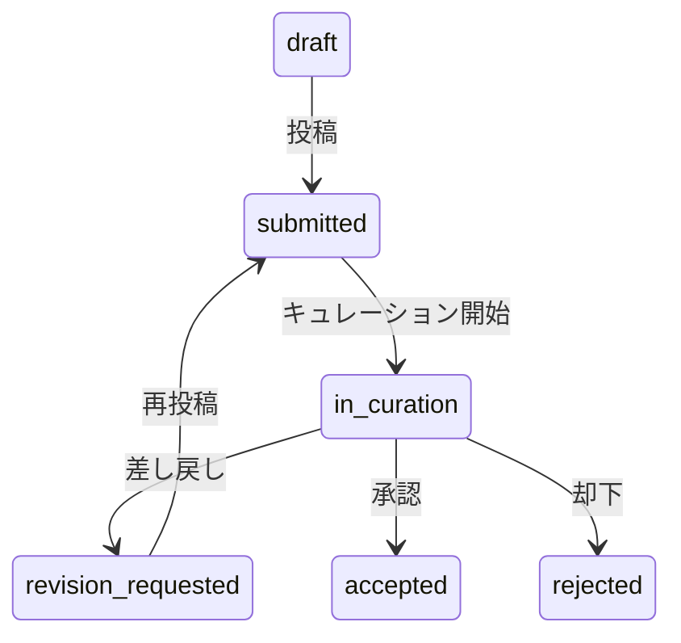

# Submission Stage 設計

record-idm が管理する `submission_stage` の設計を定義する。2 次元モデルの全体像は [データモデル](./data-model.md) を参照。

## submission_stage の定義値

| 値                   | 意味                   |
| -------------------- | ---------------------- |
| `draft`              | 作成中、未投稿         |
| `submitted`          | 投稿済み、処理待ち     |
| `in_curation`        | キュレーション/審査中  |
| `revision_requested` | 差し戻し（修正依頼中） |
| `accepted`           | 承認済み/処理完了      |
| `rejected`           | 却下                   |

submission_stage は **nullable** とする。全てのリポジトリが投稿処理段階を公開しているわけではないため、情報が取得できない場合は null とする。

## 状態遷移

## TODO

- [ ] D-way (tracesys) の DB スキーマを調査し、Trad / SRA / DRA / GEA の submission_stage が取得可能か確認する
- [x] BioProject/BioSample `5900` の意味を調査する → `temporarily_suppressed`（一時的な非公開化）。`record_status = suppressed` にマッピング
- [ ] BioProject/BioSample の `mass.submission` テーブルの `status_id`（100〜750）と `submission_stage` の関係を調査する
- [ ] JGA `appl_status_type = 70`（取り下げ）で accession 発行済みのケースがあるか調査する
- [ ] JGA `appl_status_type = 80`（利用期間終了）の record_status / submission_stage を決定する
