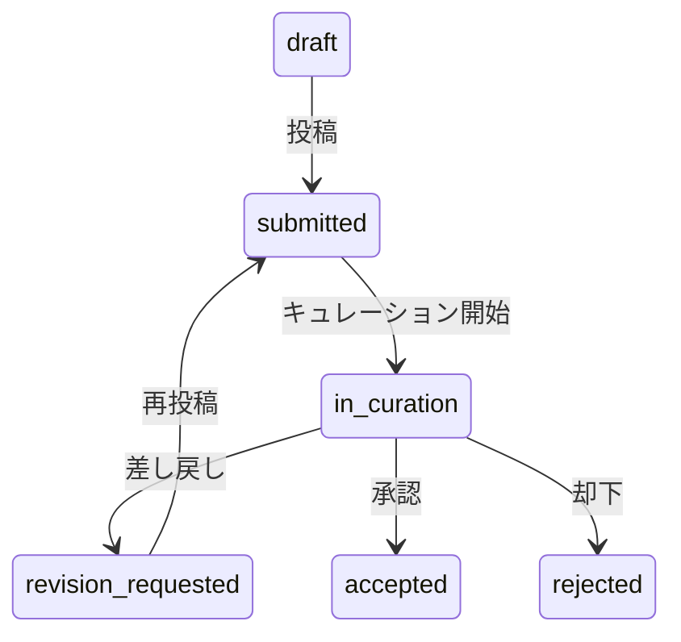

# Submission Stage 定義

record-idm が管理する `submission_stage` の定義。2 次元モデルの全体像は [data-model.md](./data-model.md) を参照。

## submission_stage の定義値

| 値                   | 意味                   |
| -------------------- | ---------------------- |
| `draft`              | 作成中、未投稿         |
| `submitted`          | 投稿済み、処理待ち     |
| `in_curation`        | キュレーション/審査中  |
| `revision_requested` | 差し戻し（修正依頼中） |
| `accepted`           | 承認済み/処理完了      |
| `rejected`           | 却下                   |

submission_stage は **nullable** とする。全てのリポジトリが投稿処理段階を公開しているわけではないため、情報が取得できない場合は null とする。Trad / SRA / DRA / GEA については D-way (tracesys) の DB スキーマが未調査であり、submission_stage が取得可能かは未確定。

## 状態遷移

